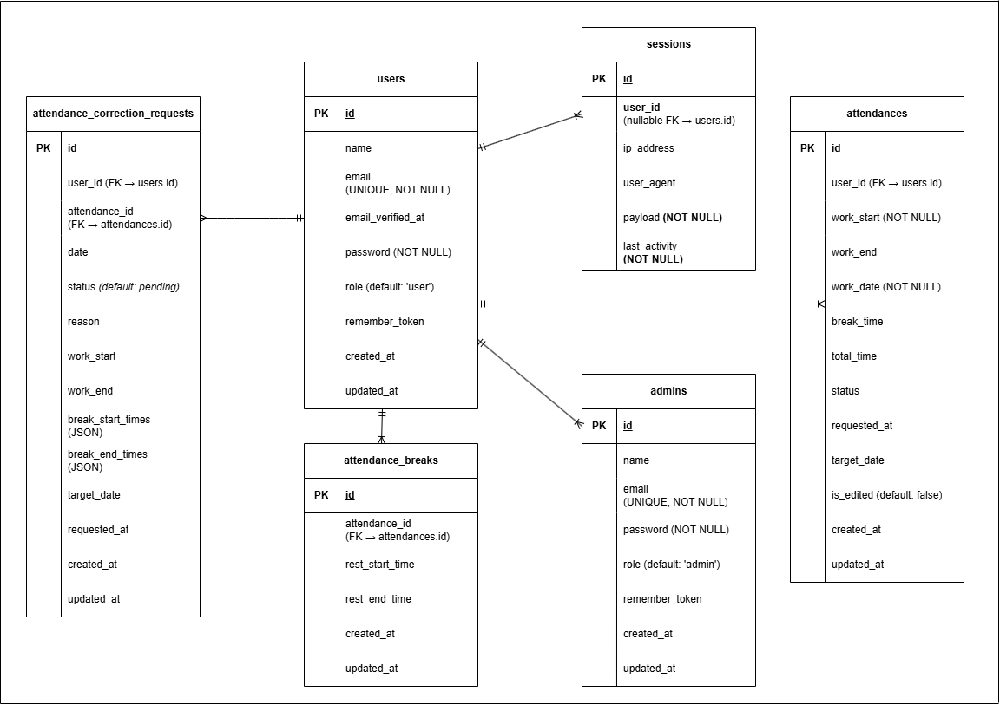

# 勤怠管理システム (Attendance Management System)

## 概要
企業の勤怠管理をデジタル化し、従業員の打刻から管理者による承認・集計までを一気通貫で行うWebアプリケーションです。
 
現場での使いやすさを重視し、直感的なUIと、不正打刻を防止するためのシンプルな操作フローを実装しました。

背景と目的
 
・課題: 紙やExcelでの管理による転記ミスや、集計作業の膨大な工数。
 
・解決策: クラウド上でリアルタイムに打刻・集計を行うことで、バックオフィス業務の効率化を目指しました。

主な機能
1. 従業員向け機能 
　・打刻機能: 出勤・退勤・休憩開始・休憩終了のワンクリック打刻。 
　・勤務履歴閲覧: 自身の月ごとの勤務時間や残業時間の確認。 
2. 管理者向け機能 
　・従業員管理: アカウントの作成、編集、削除。 
　・勤怠集計: 全従業員の勤務データの閲覧および月次集計。 

使用技術  
バックエンド 
　・PHP 8.x / Laravel 8.x
 
　・Eloquent ORM による効率的なデータベース操作。
 
　・認証機能（Laravel Fortify/Breeze等）を用いたセキュアなログイン。
 

フロントエンド
 
　・Bladeテンプレートエンジン / CSS (Tailwind CSS)
 
　・レスポンシブデザインに対応。
 

開発環境・インフラ
 
　・Docker / Docker Compose
 
　・php-fpm, nginx, mysql のコンテナ構成。
 
　・環境構築の容易化とメンバー間での環境差異の解消。
 

システム構成
 
. 
├── docker/              # Docker設定ファイル 
├── src/                 # Laravelプロジェクト本体 
│   ├── app/Models/      # ビジネスロジック 
│   ├── app/Http/Controllers/ # リクエスト制御 
│   └── resources/views/ # UIテンプレート 
└── docker-compose.yml   # コンテナオーケストレーション 
 

こだわったポイント
 
1. DB設計:
 
　・休憩時間を別テーブル（またはリレーション）で管理することで、1日に複数回の休憩をとるケースにも対応できる拡張性を持たせました。
 
2. UI/UX:
 
　・打刻状態（現在「出勤中」なのか「休憩中」なのか）を動的に判断し、次に押すべきボタンのみを活性化させることで、誤操作を防ぐ設計にしました。
 
3. 環境構築の自動化:
 
　・docker-compose up だけで開発環境が立ち上がるよう、設定を最適化しました。
 

## ER 図

## 機能一覧
 
管理者ユーザー
管理者ログイン画面

勤怠一覧画面

スタッフ一覧画面

申請一覧承認済み画面

申請一覧承認待ち画面

勤怠詳細承認画面

勤怠詳細承認済み画面

一般ユーザー
一般ログイン画面

会員登録画面

打刻画面1

打刻画面2

打刻画面3

打刻画面4

勤怠一覧画面

勤怠詳細画面

勤怠詳細修正前画面

勤怠詳細修正後画面

申請一覧承認待ち画面

申請一覧承認済み画面

